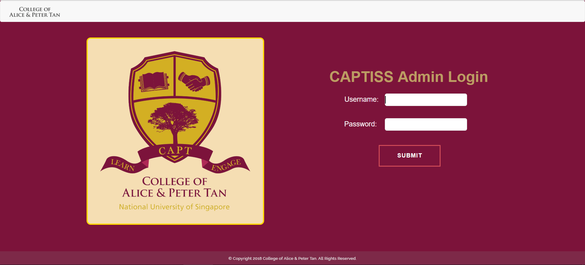
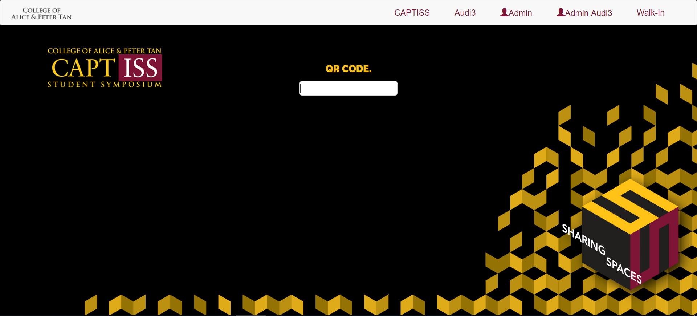
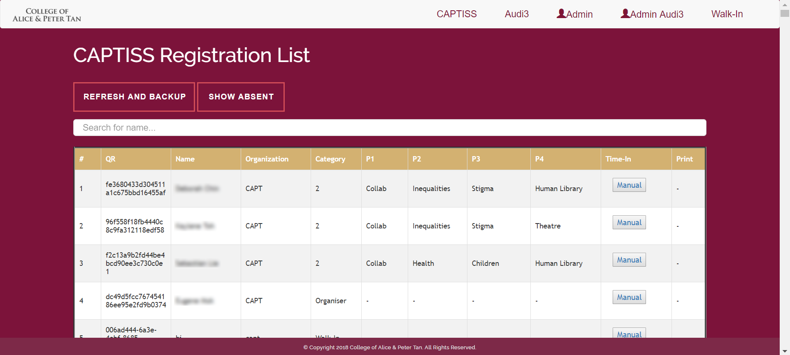

# CAPTISS QR Registration System
This is a webpage that uses scanned QR codes to record student attendance for events in our student hostel, such as the College of Alice and Peter Tan Student Symposium (CAPTISS), formal dinners, and Master's Tea sessions. It was developed to replace a manual paper registration system, so that registration queues move much faster. I implemented the webpage with Java Server Pages and Apache Tomcat, while another student I was working with implemented the UI design.

## Login Page

## QR Code Scanning Page (front facing for event registration)

## Admin Dashboard Page (information of all event registrants)

